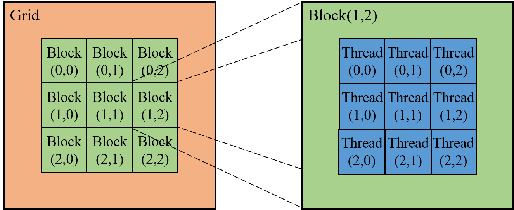
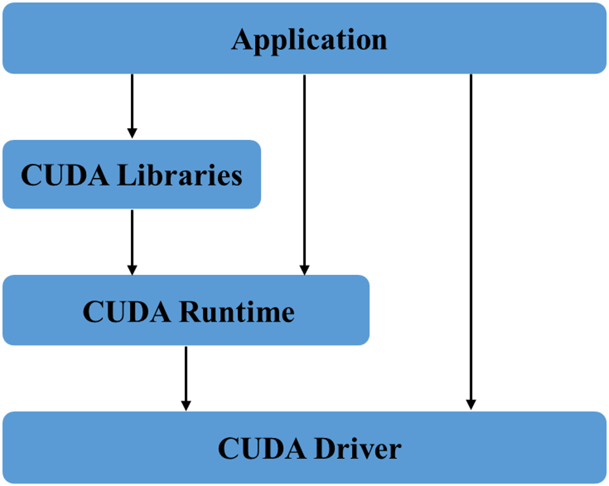

# 第8章 CUDA 扩展与编译

在第5章中，我们提到了使用GPU对PyTorch中的数据进行加速。然而，在许多场景下，我们仍需要灵活地进行一些自定义操作，这便需要用到本章介绍的PyTorch的C++扩展和CUDA扩展了。本章将用一个示例讲解C++扩展和CUDA扩展的具体流程操作，并在Python中调用扩展的结果，测试其正确性及性能差异。同时，本章介绍了CUDA运行版本和编译版本之间的关系以及cuDNN的使用。

## 8.1 PyTorch C++ extension 简介


**TODO 画一张图， 展示nn.Module, nn.functional, autograd.Function, C++, CUDA之间的调用关系**

PyTorch已经提供了很多的函数功能，但在某些场景下我们仍需使用C++或CUDA自定义一些操作，这些场景主要集中在：

- PyTorch还未支持该操作。
- PyTorch中对该操作的支持不够高效。比如某个功能可以通过循环调用PyTorch函数实现，但是不够高效。
  - Python调用本身开销比较大。每执行一次Python命令，都要通过Python调用CPython再调用C/C++ extension。当循环调用Python的次数较多，速度差异就会显现出来。
  - 计算图优化。在反向传播的时候，PyTorch利用autograd生成梯度计算规则，但这种计算规则还有优化的空间。尤其是当我们多次调用Python命令，会生成复杂的计算图，严重增加系统的开销。

- ~~在PyTorch中进行上述自定义操作，最简单的方法便是对Python语言的`Function`和`Module`进行改写，就像本书3.4.3节中扩展`torch.autograd`一样：我们可以自定义一些复杂函数，并实现它的前向传播与反向传播。但是，当你的代码需要被反复调用同时对性能的要求较高时，亦或是需要与C或C++进行对接时，我们便需要使用PyTorch提供的C++扩展方法。~~

~~PyTorch能够进行C++扩展的主要原因与其底层、后端实现有关。深度学习框架~PyTorch的后端基于C和C++构建，上面留有了C和C++的扩展接口。而且，PyTorch是基于Torch构建的，而Torch的底层正好是用C语言实现的，所以说PyTorch对C语言天生具有兼容性。PyTorch的C++扩展方法与PyTorch的原生操作有些不一样，C++扩展更倾向于为PyTorch后端提供相关操作的样板，因此使用C++扩展后，整个PyTorch项目会更加灵活。~~

~~通常情况下，正如本书第3.4.3节中介绍的，我们可以直接定义一个class类，重写其前向传播函数与反向传播函数便能起到扩展PyTorch的作用，同时由于PyTorch对CPU和GPU进行了高度的优化，自定义的类也能够快速执行。那么我们为什么还需要将其改写成C++或CUDA扩展呢？这是因为该做法有一些性能和逻辑上的缺陷：~~

- ~~运行代码时需要调用Python解释器，这个过程就会减慢程序的速度；~~
- ~~PyTorch不会真正了解自定义类的算法逻辑，而只能优化我们新编写算法的各个独立操作；~~
- ~~PyTorch必须依次执行我们定义的操作，而每次调用都有可能存在调用CUDA内核的开销；当需要调用这个过程的独立操作很多时，性能将受到影响。~~

### 8.1.1 C++扩展

接下来我们将举例说明如何编写PyTorch的C++扩展，本节的例子不涉及CUDA代码，主要为了讲解如何使用PyTorch的C++接口。在这个例子中我们将完成函数$y=x^2+b$的前向传播和反向传播过程。

普通的C++ extension可以分成三步：

1. 定义并实现C++ 函数，使用pybind11生成函数的CPython接口。
2. 使用`setuptools`编译安装。
3. 自定义`autograd.Function`调用该函数的CPython接口，后续可在`nn.Module`中使用该Function

整个工程的文件目录如下：

```
|__ CppExtension
	|—— src
		|—— MyLinear.h
		|__ MyLinear.cpp
	|__ setup.py
```

首先编写C++头文件`MyLinear.h`，定义前向传播和反向传播函数。这里我们使用了`torch/torch.h`头文件，它是一个一站式头文件，其中包含了张量计算接口库`ATen`、绑定C++和Python的`pybind11`方法（使用前请在Python环境下通过命令`pip install pybind11`安装相应环境）以及管理`ATen`和`pybind11`的其他文件。

```c++
// ./src/MyLinear.h
#include<torch/torch.h>
#include<vector>
#include<iostream>

// 前向传播 过程中用到了参数x和b
std::vector<at::Tensor> MyLinearForward(const at::Tensor& x, const at::Tensor& b);
// 反向传播 过程中用到了回传参数和参数x
std::vector<at::Tensor> MyLinearBackward(const at::Tensor& x, const at::Tensor& grad_out);
```

接着，我们需要将前向传播和反向传播的整个过程实例化为C++代码。C++的扩展API不能像`autograd`一样自动计算，因此我们需要手动完成反向传播的计算过程，然后使用`pybind11`将C++创建的函数绑定在Python上。`PYBIND11_MODULE`中的宏`TORCH_EXTENSION_NAME`会被定义为`setup.py`脚本中的扩展名名称。

```c++
// ./src/MyLinear.cpp
#include "MyLinear.h" // 导入头文件

// 前向传播函数，注意Tensor的shape要一致
std::vector<at::Tensor> MyLinearForward(const at::Tensor& x, const at::Tensor& b){
    at::Tensor y = at::zeros(x.sizes());
    y = x * x + b;
    return {x, y};
}

// 反向传播函数，grad_out是上一级梯度回传的值，根据链式法则需要乘上去
std::vector<at::Tensor> MyLinearBackward(const at::Tensor& x, const at::Tensor& grad_out){
    at::Tensor grad_x = 2 * x * grad_out * at::ones(grad_out.sizes());
    at::Tensor grad_b = grad_out * at::ones(grad_out.sizes());
    return {grad_x, grad_b};
}

// 绑定C++函数到python上，TORCH_EXTENSION_NAME即为setup.py中setup定义的name
PYBIND11_MODULE(TORCH_EXTENSION_NAME, m) {
  m.def("forward",  &MyLinearForward,  "mylinear forward" );
  m.def("backward", &MyLinearBackward, "mylinear backward");
}
```

最后，就是利用`setuptools`完成对C++代码的编译和C++扩展的构建了。当构建完成后，C++的扩展将被命名为`mylinear`，以后在Python中就能调用这个模块了。

```python
# ./setup.py
from setuptools import setup
import os
from torch.utils.cpp_extension import BuildExtension, CppExtension

# 头文件目录
include_dirs = "./src"
# 源代码目录
source = ["./src/MyLinear.cpp"]

setup(
    name='mylinear',  # 模块名称，宏TORCH_EXTENSION_NAME的值
    version="0.1",
    ext_modules=[CppExtension('mylinear', sources=source, include_dirs=[include_dirs]),],
    cmdclass={'build_ext': BuildExtension}
)
```

我们可以在`setup.py`的目录下运行`python setup.py install`，完成这个C++模块的编译构建。该模块最后会安装在Python的site-packages中，读者若看到如下输出则表示该模块构建成功。在这里官方文档强调了编译时的版本问题：用于构建C++扩展的编译器必须与ABI兼容，同时这里的编译器必须与构建PyTorch时采用的编译器一样，即必须在Linux上使用4.9及更高版本的GCC。

现在我们便可以编写一个测试函数，来验证我们刚刚构建的C++扩展是否正确。

TODO 把本章所有的代码也加入到git repo

```python
import torch
from torch.autograd import Function
import mylinear # 导入我们的扩展

# 将扩展的前向传播和反向传播封装为一个Function对象
class MyLinear(Function):
    @staticmethod
    def forward(ctx, x, b):
        t_x, t_y = mylinear.forward(x, b)
        vars = [t_x]
        ctx.save_for_backward(*vars) # 必须在变量前加*TODO 直接ctx.save_for_backward(t_x) 行不行（zlx:不行）
        return t_y

    @staticmethod
    def backward(ctx, grad_out):
        grad_x, grad_b = mylinear.backward(*ctx.saved_tensors, grad_out)
        # 必须将mylinear.backward返回值解耦后分别返回，不然是一个对象
        return grad_x, grad_b 

# 构建用于测试的示例类Test
class Test(torch.nn.Module):
    def __init__(self):
        super().__init__()

    def forward(self, x, b):
        return MyLinear.apply(x, b)

# 测试
def main():
    x1 = torch.tensor([1.,2.,3.], requires_grad=True)
    b1 = torch.tensor([1.,2.,3.], requires_grad=True)
    x2 = x1.clone().detach().requires_grad_()
    b2 = b1.clone().detach().requires_grad_()
    
    # C++ Extension
    model = Test()
    y1 = model(x1, b1)
    y1.sum().backward()

    # Python接口
    y2 = x2 ** 2 + b2
    y2.sum().backward()
    
    assert y1.equal(y2)
    assert x1.grad.equal(x2.grad)
    assert b1.grad.equal(b2.grad)

if __name__ == '__main__':
    main()
```

运行测试函数的时候，如果没有抛出异常，表示自定义的C++扩展与直接使用PyTorch反向传播的结果一致。

### 8.1.2 CUDA扩展

上一小节我们主要介绍了PyTorch的C++扩展方式，但是当扩展中包含大量的逐点运算和矩阵运算时，C++扩展的性能依旧有限。因此在这种情况下，我们可以对CUDA内核进行自定义，像C++扩展一样自行编写前向传播和反向传播部分的代码，将逐点运算和矩阵运算放进CUDA内核中进行融合和并行化，进一步提升程序的性能。

编写CUDA扩展的流程和C++扩展类似，首先我们编写一个C++文件用于定义Python中会调用的函数，同样使用`pybind11`将这些函数绑定在Python上。同时，在CUDA文件中定义的函数也会在该C++文件中进行声明，最后将调用转发给CUDA函数。然后，编写一个CUDA（以`.cu`为后缀结尾）文件自定义实际的CUDA内核，这里面将使用一些CUDA语法，稍后会简要介绍。下面我们将使用CUDA扩展重写C++扩展的示例。

首先是用C++编写Python会调用的函数，这部分与C++扩展部分几乎一致（实现的功能一样）。

```c++
// ./src/linear_cuda.cpp
#include <torch/torch.h>
#include <vector>

// 前向传播
std::vector<at::Tensor> linear_cuda_forward(const at::Tensor& x, const at::Tensor& b){
    at::Tensor y = at::zeros_like(x);
    y = x * x + b;
    return {x, y};
}

// 反向传播
std::vector<at::Tensor> linear_cuda_backward(const at::Tensor& x, const at::Tensor& grad_y){
    at::Tensor grad_x = 2 * x * grad_y * at::ones_like(grad_y);
    at::Tensor grad_b = grad_y * at::ones_like(grad_y);
    return {grad_x, grad_b};
}

// 绑定C++函数到python上
PYBIND11_MODULE(TORCH_EXTENSION_NAME, m) {
  m.def("forward",  &linear_cuda_forward,  "linear cuda forward");
  m.def("backward", &linear_cuda_backward, "linear cuda backward");
}
```

接下来是CUDA扩展的核心部分，即编写CUDA内核。在编写相关代码前，先简要介绍一些CUDA内核的组成。当我们开始使用CUDA，我们就获得了计算机GPU的控制权。由于CUDA中有很多的核在多线程执行运算，所以在我们调用函数时需要指明使用哪些线程。CUDA将一个kernel分为三级：Grid，Block和Thread。如图8-1所示，这里的Grid和Block考虑为二维情况（大部分使用的时候都是二维的），它们都是`dim3`类型的变量，`dim3`类型可以看做一个无符号的整数三元组`(x,y,z)`组成，初始化时灵活地将其部分定义为1就可以轻松的实现`1-dim`，`2-dim`以及`3-dim`结构。



<center>图8-1  CUDA中的Grid,Block与Thread</center>

定义完Grid和Block后，每一个线程的全局ID可以通过一组坐标来进行唯一的标识：`（blockIdx，threadIdx）`，基于这一组唯一标识可以为不同的核心获取相对应的输入，并可以在线程中经过计算后输出到对应的位置。其中`blockIdx`表明了Block在Grid中的位置，`threadIdx`表明了线程在Block中的位置，例如图中Block(2,1)里的Thread(2,1)就可以表示为：

```c
threadIdx.x = 2
threadIdx.y = 1
blockIdx.x = 1
blockIdx.y = 2
```

同时，我们通常还需要把一个线程在Block中的全局ID从多维的Tensor转换为一维的形式。这个类似于计算一个经过reshape的Tensor其某一个位置的元素对应于底层Storage的Offset，在这里对于一个二维的Block，形如：$(b lockDim.x,blockDim.y)$，线程$(x,y)$的ID值就可以表示为$x+y\times blockDim.x$。

此外，CUDA的多线程计算在逻辑层和物理层上还有一些区别。当一个kernel启动多个线程的时候，所有的线程就称为一个grid，再把这个grid分成多个线程块（block），这些线程在逻辑上是并行的，但是在物理层上却不一定。GPU硬件的核心组件是SM（流式多处理器），它包含着一些CUDA核心、共享内存和寄存器。当一个kernel在执行的时候，grid中的线程块会被分配到SM上（一个SM可以调度多个线程块，但是一个线程块只能由一个SM调度），由于SM同时处理的线程数量是有限的，所以一个kernel下的所有线程在物理层上不一定是同时并发的。因此，在我们编写核函数的时候，需要有效利用线程的序列号来分配计算任务，尽量平均的将计算量分给各个线程进行计算。如果，程序的计算量超过了线程的数量，系统将循环地将任务分配给线程，完成最终的计算任务。kernel凭借这种线程的组织结构，在矩阵运算上十分高效。

在CUDA中还有几种特殊的声明方式：

- \_\_global\_\_：异步模式，在CPU中调用，在GPU上执行，CPU不会等待kernel执行完就服执行下一步；
- \_\_device\_\_：直接从GPU调用函数在GPU中执行，不可与\_\_global\_\_同时使用；
- \_\_host\_\_：同步模式， 从CPU上调用在CPU中执行，一般可以省略不写。

```c++
// ./src/linear_cuda_kernel.cu （注意后缀名是.cu）
#include <ATen/ATen.h>
#include <cuda.h>
#include <cuda_runtime.h>
#include <vector>

// scalar_t是一个宏，特化的时候会传入具体的类型，下面调用的时候实例化为at::Tensor
// 定义了前向传播的cuda内核
template <typename scalar_t>
__global__ void linear_cuda_forward_kernel(
const scalar_t* x, const scalar_t* b, scalar_t* y) {
    const int index = blockIdx.x + blockDim.x * blockIdx.y;
    y[index] = x[index] * x[index] + b[index];
}

// 定义了反向传播的cuda内核
template <typename scalar_t>
__global__ void linear_cuda_backward_kernel(
const scalar_t* grad_y, const scalar_t* x, scalar_t* grad_x, scalar_t* grad_b ) {
    const int index = blockIdx.x + blockDim.x * blockIdx.y;
    grad_x[index] = 2 * x[index] * grad_y[index];
    grad_b[index] = grad_y[index];
}


at::Tensor linear_cuda_forward(at::Tensor x, at::Tensor b) {
    auto y = at::zeros_like(x);
    // forward kernel线程配置
    const dim3 blocks(x.size(0), x.size(1));
    const int threads = 4;
	// forward kernel调用，使用参数按照引用传递的匿名函数
    AT_DISPATCH_FLOATING_TYPES(x.type(), "linear_forward_cuda", ([&] {
        linear_cuda_forward_kernel<scalar_t><<<blocks, threads>>>(
        x.data<scalar_t>(),
        b.data<scalar_t>(),
        y.data<scalar_t>());
  }));
  return y;
}

at::Tensor linear_cuda_backward(at::Tensor grad_y, at::Tensor x) {
    auto grad_x = at::zeros_like(grad_y);
    auto grad_b = at::zeros_like(grad_y);
    // backward kernel线程配置
    const dim3 blocks(grad_y.size(0), grad_y.size(1));
    const int threads = 4;
	// backward kernel调用  使用参数按照引用传递的匿名函数
    AT_DISPATCH_FLOATING_TYPES(grad_y.type(), "linear_backward_cuda", ([&] {
    linear_cuda_backward_kernel<scalar_t><<<blocks, threads>>>(
        grad_y.data<scalar_t>(),
        x.data<scalar_t>(),
        grad_x.data<scalar_t>(),
        grad_b.data<scalar_t>());
  }));
  return grad_x, grad_b;
}
```

在完成C++绑定Python函数以及CUDA内核编写过后，接下来就需要利用setuptools（构建扩展时还可以采用JIT进行实时扩展，在这里我们依然采用setuptools的方式进行）完成对C++和CUDA代码的编译以及CUDA扩展的构建了。与C++扩展不同，CUDA扩展除了使用`CppExtension`以外，还会同时使用`CUDAExtension`。

```python
# ./setup.py
from setuptools import setup
from torch.utils.cpp_extension import BuildExtension, CUDAExtension, CppExtension

setup(
    name='linear_cuda', # 模块名称，用于import调用
    ext_modules=[
        CUDAExtension('linear_cuda', 
        [
            './src/linear_cuda_kernel.cu',
            './src/linear_cuda.cpp',
        ])
    ],
    cmdclass={
        'build_ext': BuildExtension
    })
```

现在，整个工程的目录如下所示：

```
|__ CUDApExtension
	|—— src
		|—— linear_cuda_kernel.cu
		|__ linear_cuda.cpp
	|__ setup.py
```

与C++扩展一样，在`setup.py`的目录下运行`python setup.py install`，将完成这个CUDA扩展的构建，最后会安装在Python的site-packages中，看到如下代码表示构建成功：

```
... ...
Installed /home/admin/anaconda3/lib/python3.7/site-packages/linear_cuda-0.0.0-py3.7-linux-x86_64.egg
Processing dependencies for linear-cuda==0.0.0
Finished processing dependencies for linear-cuda==0.0.0
```

同样的，在当前目录下编写一个`test.py`文件，验证刚刚构建的CUDA扩展是否成功。这部分测试代码与C++扩展中的类似。

```python
# ./test.py
import torch
from torch.autograd import Function
import linear_cuda # 导入模块

class Linear_CUDA(Function):
    @staticmethod
    def forward(ctx, x, b):
        t_x, t_y = linear_cuda.forward(x, b)
        vars = [t_x]
        ctx.save_for_backward(*vars)
        return t_y

    @staticmethod
    def backward(ctx, grad_y):
        grad_x, grad_b = linear_cuda.backward(*ctx.saved_tensors, grad_y)
        return grad_x, grad_b


class Test(torch.nn.Module):
    def __init__(self):
        super().__init__()

    def forward(self, x, b):
        return Linear_CUDA.apply(x, b)

def main():
    x1 = torch.randn(500, 500).cuda().requires_grad_()
    b1 = torch.randn(500, 500).cuda().requires_grad_()
    model = Test().cuda()
    y1 = model(x1, b1)
    y1.sum().backward()

    x2 = x1.clone().detach().cuda().requires_grad_()
    b2 = b1.clone().detach().cuda().requires_grad_()
    y2 = x2 ** 2 + b2
    y2.sum().backward()
    
    assert y1.equal(y2)
    assert x1.grad.equal(x2.grad)
    assert b1.grad.equal(b2.grad)

if __name__ == '__main__':
    main()
```

运行测试函数的时候，如果没有抛出异常，表示自定义的CUDA扩展与直接使用PyTorch反向传播的结果一致。

至此，我们已经完成了PyTorch的C++扩展和CUDA扩展。这两种扩展方式在构建上异曲同工，都是将重写的前向传播函数和反向传播函数绑定到Python上，然后install成可以引入的包。最后在调用时，利用这个包实例化一个自定义对象即可。

### 8.1.3 性能比较

这一小节我们将总结一下C++扩展模块与CUDA扩展模块的性能测试情况。我们测试了一个高维矩阵进行矩阵相乘的场景，相比于直接使用Python原生的For循环，C++扩展省去了大量的上层调用，速度上有了明显的提升，而CUDA扩展有效利用了内核多线程并行计算的特性，将时间复杂度高的串行计算优化为速度更快的并行计算，性能在三者中最优。

## 8.2 CUDA/NVIDIA-driver/cudnn/Python 之间的关系

在利用PyTorch框架进行深度学习的研究过程中，由于PyTorch和CUDA更新迭代速度很快，因此我们经常会遇到CUDA运行版本、编译版本与框架代码不匹配等问题，本小节将对这些问题进行总结。

NVIDIA-driver 是针对于英伟达GPU显卡的驱动程序，在安装PyTorch框架、CUDA等之前得提前保证已经安装的驱动程序。NVIDIA-driver是向下兼容的，意思就是系统的NVIDIA-driver版本决定着系统可以支持什么版本下的CUDA和cudatoolkit。因此，NVIDIA-driver的版本不需要刻意与CUDA版本对齐，只需要保持一个较高的版本就行。下面是部分CUDA Toolkit和NVIDIA-driver版本的对应信息。

|     CUDA Toolkit     | Linux x86_64 Driver Version | Windows x86_64 Driver Version |
| :------------------: | :-------------------------: | :---------------------------: |
|     CUDA 11.1 GA     |          >=455.23           |           >=456.38            |
|    CUDA 11.0.1 RC    |        >= 450.36.06         |           >= 451.22           |
| CUDA 10.1 (10.1.105) |          >= 418.39          |           >= 418.96           |
|    CUDA 10.0.130     |          >= 410.48          |           >= 411.31           |
|  CUDA 9.0 (9.0.76)   |          >= 384.81          |           >= 385.54           |
|  CUDA 8.0 (8.0.44)   |          >= 367.48          |           >= 369.30           |
|  CUDA 7.5 (7.5.16)   |          >= 352.31          |           >= 353.66           |

实际上，我们可以通过Anaconda完成PyTorch和CUDA的安装。在第二章快速入门中我们已经详细介绍了PyTorch的安装方法，如果读者选择安装支持GPU计算的PyTorch，那么在Anaconda的安装目录下便可以发现它已经为我们安装了cudatoolkit。然而这个cudatoolkit与官方提供的CUDA Toolkit存在一些差距。首先，官方提供的CUDA Toolkit是一个完整的工具安装包，包含了CUDA-C和CUDA-C++编译器以及nvcc。由于CUDA程序有两种代码，一种是运行在CPU上的host代码，另一种是运行在GPU上的device代码，nvcc编译器保证了两部分代码的编译结果能够在不同机器上运行。在Linux下可以通过命令`nvcc --version`或`nvcc -V`查看。

```
nvcc: NVIDIA (R) Cuda compiler driver
Copyright (c) 2005-2017 NVIDIA Corporation
Built on Fri_Nov__3_21:07:56_CDT_2017
Cuda compilation tools, release 9.1, V9.1.85
```

除此之外，CUDA Toolkit还包含了进行 CUDA 开发的编译、调试等相关组件。虽然对于PyTorch框架而言不是那么重要，这是因为PyTorch在使用GPU时大多数情况下只是调用了CUDA的动态链接库来支持程序的运行，PyTorch部分和CUDA部分的代码是提前编译好的，这个过程不需要重新编译，直接在依赖的动态链接库中执行即可。而利用Anaconda安装PyTorch时会自动安装cudatoolkit，这里面就包含了应用程序在使用CUDA功能时的动态链接库，此时就不需要安装官方的CUDA Toolkit工具包。但是，如果需要给PyTorch框架添加一些CUDA扩展，并对编写的CUDA相关程序进行编译操作时，此时就需要安装官方提供的完整的CUDA Toolkit工具包。

在NVIDIA-driver支持下，利用`nvidia-smi`可以查看相关版本信息，也可以管理和监控GPU设备。

```
Tue Dec  8 10:45:19 2020       
+-----------------------------------------------------------------------------+
| NVIDIA-SMI 430.26       Driver Version: 430.26       CUDA Version: 10.2     |
|-------------------------------+----------------------+----------------------+
| GPU  Name        Persistence-M| Bus-Id        Disp.A | Volatile Uncorr. ECC |
| Fan  Temp  Perf  Pwr:Usage/Cap|         Memory-Usage | GPU-Util  Compute M. |
|===============================+======================+======================|
|   0  GeForce GTX 108...  Off  | 00000000:02:00.0 Off |                  N/A |
|  0%   60C    P5    27W / 280W |      0MiB / 11177MiB |      0%      Default |
+-------------------------------+----------------------+----------------------+
                                                                               
+-----------------------------------------------------------------------------+
| Processes:                                                       GPU Memory |
|  GPU       PID   Type   Process name                             Usage      |
|=============================================================================|
|  No running processes found                                                 |
+-----------------------------------------------------------------------------+
```

从两个版本信息查看结果中我们可以发现，`nvcc --version`中的CUDA版本是9.1而`nvidia-smi`中的CUDA版本是10.2，为什么这两个版本号不同，但是代码还能正常运行呢？这是因为CUDA中有两个API，一个是runtime API，一个是driver API，它们都有对应的版本号。用于支持driver API的是通过GPU驱动安装的，`nvidia-smi`就属于这个；用于支持runtime API是通过CUDA Toolkit安装的，CUDA Toolkit Installer有时可能会集成了GPU driver Installer，nvcc是同CUDA Toolkit一起安装的，只会反映出CUDA的runtime API版本。因此这两个版本号不一定是一致的。CUDA中API之间的关系如图8-2所示。



<center>图8-2  CUDA中几种API之间的关系</center>

一个应用只能使用其中一个API，相比之下runtime API拥有高层级的封装，运行时可以编译并将CUDA内核链接到可执行文件中，通过隐式初始化、上下文管理和模块管理简化了设备代码管理。相比之下，driver API更加接近底层，编程实现更加困难，但是能够查询到更加详细的设备信息。

最后是cudnn，这是一个专门为深度学习设计的软件库。cudnn提供了深度神经网络GPU加速库，里面包含了大量封装好的计算函数，例如卷积、池化等操作，目的是保障性能、可用性以及提供更低的内存开销。同时，英伟达的cudnn还可以集成到一些高级的机器学习框架中，如PyTorch、TensorFlow等。cudnn通过简单的插入式操作便能使用，从而在GPU上实现高性能的并行计算，用户无需浪费时间在GPU性能的调优上。所谓插入式操作是指，只需要将cudnn的文件复制到CUDA对应的文件夹里，即完成了CUDA的扩展，不会对CUDA本身造成其他的影响。

## 8.3 本章小结

本章主要对PyTorch的C++扩展和CUDA扩展进行了介绍，并用一个简单的示例对其扩展方法进行了演示，最后分析了二者的性能差距。同时，本章分析了CUDA运行版本、编译版本与代码不匹配的问题，读者在实际使用时只需要保证一个较高的NVIDIA-driver版本即可。

